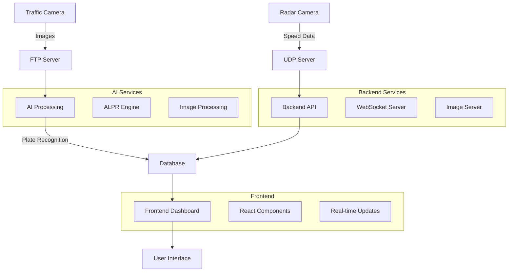

# Potassium All - Comprehensive Radar Speed Detection & License Plate Recognition System

## 🚀 Overview
A complete integrated system combining radar speed detection, automatic license plate recognition (ALPR), and comprehensive violation management. This system consists of three main repositories working together to provide a full-stack solution for traffic monitoring and violation management.

## 📦 Repository Structure
This project integrates three separate repositories:

### 1. **Frontend Repository** 
🔗 **Repository**: [potassium-frontend](https://github.com/basharagb/potassium-frontend.git)
- **Technology**: React.js with TypeScript
- **Purpose**: Web dashboard for monitoring violations, managing users, and viewing analytics
- **Features**: Real-time monitoring, multi-camera support, user authentication, violation management

### 2. **Backend Repository**
🔗 **Repository**: [potassium-backend](https://github.com/basharagb/potassium-backend-.git)  
- **Technology**: Node.js with Express.js
- **Purpose**: API server, database management, and business logic
- **Features**: RESTful APIs, MySQL integration, user management, violation processing

### 3. **AI Repository** 
🔗 **Repository**: [Automatic-License-Plate-Recognition](https://github.com/basharagb/Automatic-License-Plate-Recognition.git)
- **Technology**: Python with OpenCV and YOLOv8
- **Purpose**: Automatic license plate recognition and AI processing
- **Features**: Plate detection, character recognition, image processing, AI model training

## 🏗️ System Architecture & Integration

### Complete System Flow


### Key Integration Points

#### 1. **Radar-Camera Correlation System**
- **Time-based Matching**: Correlates radar speed data with camera images within 2-second windows
- **Violation Detection**: Automatically creates fines when speed exceeds limits
- **Image Association**: Links multiple camera angles to single violation events

#### 2. **AI-Backend Integration**
- **Plate Recognition API**: Backend calls AI service at `http://127.0.0.1:38185/plate-recognition`
- **Automatic Sync**: Plate recognition data automatically synced to fines database
- **Confidence Filtering**: Only processes plates with >70% confidence
- **Batch Processing**: Handles multiple images efficiently

#### 3. **Real-time Data Flow**
- **UDP Server**: Receives radar data on port 17081
- **WebSocket Broadcasting**: Real-time updates to frontend on port 18081
- **FTP Processing**: Automatic image processing from camera uploads
- **Database Persistence**: All data stored in MySQL with proper relationships

#### 4. **Multi-Camera Support**
- **Dynamic Discovery**: Automatically detects available cameras
- **Unlimited Scaling**: Supports camera001, camera002, camera003, etc.
- **Load Balancing**: Distributes processing across multiple AI instances

## 🚀 Quick Start

```bash
# Clone the repository
git clone https://github.com/basharagb/potassium-frontend.git
cd potassium-frontend

# Install dependencies and start all services
chmod +x start-all.sh
./start-all.sh
```

**Access the system**: http://localhost:3000

## 📋 System Requirements

### Hardware Requirements
- **OS**: Ubuntu 20.04+ or any Linux distribution
- **Node.js**: Version 18.0.0 or newer
- **MySQL**: Version 8.0 or newer
- **RAM**: 4GB minimum, 8GB recommended
- **Disk Space**: 10GB minimum
- **Network**: Ethernet connection for camera integration

### Software Dependencies
- Git (for cloning the project)
- curl (for API testing)
- PM2 (optional, for production deployment)

## 🛠️ Installation Guide

### 1. System Prerequisites

#### Update System
```bash
sudo apt update && sudo apt upgrade -y
```

#### Install Node.js & npm
```bash
# Install Node.js 18
curl -fsSL https://deb.nodesource.com/setup_18.x | sudo -E bash -
sudo apt-get install -y nodejs

# Verify installation
node --version
npm --version
```

#### Install MySQL
```bash
# Install MySQL Server
sudo apt install mysql-server -y

# Secure MySQL installation
sudo mysql_secure_installation

# Login to MySQL
sudo mysql -u root -p
```

#### Create Database
```sql
-- In MySQL shell
CREATE DATABASE potassium_backend CHARACTER SET utf8mb4 COLLATE utf8mb4_unicode_ci;
CREATE USER 'root'@'localhost' IDENTIFIED BY 'RootPass2025';
GRANT ALL PRIVILEGES ON potassium_backend.* TO 'root'@'localhost';
FLUSH PRIVILEGES;
EXIT;
```

### 2. Project Installation

#### Clone Repository
```bash
git clone https://github.com/basharagb/potassium-frontend.git
cd potassium-frontend
```

#### Install Dependencies

**Backend Dependencies:**
```bash
cd backend
npm install
cd ..
```

**Frontend Dependencies:**
```bash
cd frontend
npm install
cd ..
```

#### Database Setup
```bash
# Import database structure
mysql -u root -p potassium_backend < backend/potassium_backend.sql

# Run seeders (create test data)
cd backend
npm run seed
cd ..
```

#### Create Required Directories
```bash
# Create system directories
sudo mkdir -p /srv/processing_inbox
sudo mkdir -p /srv/camera_uploads
sudo chown -R $USER:$USER /srv/processing_inbox
sudo chown -R $USER:$USER /srv/camera_uploads

# Create test data for demonstration
mkdir -p /srv/processing_inbox/camera001/2025-10-06/case001
mkdir -p /srv/processing_inbox/camera002/2025-10-06/case001
mkdir -p /srv/processing_inbox/camera002/2025-10-06/case002
```

## 🚀 Running the System

### Method 1: Automated Start (Recommended)
```bash
# Make scripts executable
chmod +x start-all.sh stop-all.sh

# Start all services
./start-all.sh
```

### Method 2: Manual Start

#### Start Backend Server
```bash
cd backend
npm start
# Runs on port 3001
```

#### Start Image Server
```bash
# In new terminal
cd frontend
node local-image-server.js
# Runs on port 3003
```

#### Start Frontend
```bash
# In new terminal
cd frontend
npm start
# Runs on port 3000
```

## 🌐 System Access

### Access URLs
- **Main Dashboard**: http://localhost:3000
- **Backend API**: http://localhost:3001
- **Image Server**: http://localhost:3003

### Test Login Credentials
```
Administrator:
Email: admin@potasfactory.com
Password: admin123

Operator:
Email: operator@potasfactory.com
Password: operator123

Viewer:
Email: viewer@potasfactory.com
Password: viewer123
```

## 📁 Project Structure

```
radar_system_clean/
├── backend/                    # Backend server
│   ├── config/                # Database configuration
│   ├── controllers/           # Business logic controllers
│   ├── models/               # Database models
│   ├── routes/               # API routes
│   ├── seeders/              # Test data seeders
│   ├── services/             # Business services
│   ├── .env                  # Environment variables
│   ├── server.js             # Main server file
│   └── package.json          # Node.js dependencies
│
├── frontend/                  # Frontend application
│   ├── src/                  # React source code
│   │   ├── components/       # Reusable components
│   │   ├── pages/           # Page components
│   │   ├── services/        # API services
│   │   └── utils/           # Utility functions
│   ├── public/              # Static files
│   ├── local-image-server.js # Image processing server
│   └── package.json         # React dependencies
│
├── start-all.sh              # Start all services script
├── stop-all.sh               # Stop all services script
├── install.sh                # Installation script
└── README.md                 # This documentation
```

## ✨ Comprehensive System Features

### 🎯 **Frontend Features** (React Dashboard)
- **Real-time Violation Monitoring**: Live dashboard with WebSocket updates
- **Multi-camera Support**: Dynamic camera discovery and unlimited camera scaling
- **User Management**: Role-based access control (Admin, Operator, Viewer)
- **Interactive Analytics**: Charts, statistics, and violation trends
- **Image Gallery**: High-resolution violation photos with zoom capabilities
- **Date-based Filtering**: Advanced filtering by date ranges and cameras
- **Responsive Design**: Mobile-friendly interface with modern UI/UX
- **Export Functionality**: Export violation data and reports

### ⚙️ **Backend Features** (Node.js API)
- **RESTful API**: Complete REST API with comprehensive endpoints
- **Database Management**: MySQL integration with optimized queries
- **JWT Authentication**: Secure token-based authentication system
- **WebSocket Server**: Real-time data broadcasting to frontend
- **UDP Server**: Radar data reception and processing
- **FTP Integration**: Automatic image processing from camera uploads
- **Correlation Engine**: Time-based matching of radar and camera data
- **Batch Processing**: Efficient handling of large datasets
- **API Rate Limiting**: Protection against abuse and overload
- **Comprehensive Logging**: Detailed system and error logging

### 🤖 **AI Features** (ALPR System)
- **License Plate Detection**: Advanced computer vision with OpenCV
- **Character Recognition**: OCR with high accuracy rates
- **YOLOv8 Integration**: State-of-the-art object detection
- **Jordanian Plate Support**: Specialized for Jordanian license plates
- **Batch Image Processing**: Process multiple images simultaneously
- **Confidence Scoring**: Accuracy metrics for each detection
- **Data Augmentation**: Training data enhancement techniques
- **Model Training**: Custom model training capabilities
- **API Service**: HTTP API for plate recognition requests
- **Performance Optimization**: GPU acceleration support

### 🔄 **Integration Features**
- **Radar-Camera Correlation**: Automatic matching within 2-second windows
- **AI-Backend Sync**: Seamless plate recognition data synchronization
- **Multi-source Data**: Combines radar, camera, and AI data
- **Real-time Processing**: Live data flow from cameras to dashboard
- **Persistent Storage**: All data stored with proper relationships
- **Error Recovery**: Robust error handling and data integrity
- **Scalable Architecture**: Supports unlimited cameras and processing nodes

### 📊 **Analytics & Reporting**
- **Violation Statistics**: Real-time compliance and violation rates
- **Camera Performance**: Individual camera statistics and health
- **Plate Recognition Metrics**: AI accuracy and processing statistics
- **System Health Monitoring**: Server status and performance metrics
- **Historical Trends**: Long-term violation pattern analysis
- **Export Capabilities**: PDF, CSV, and JSON export formats

## 🔧 Comprehensive API Documentation

### 🔐 **Authentication APIs**
```bash
POST /api/auth/signin          # User login
POST /api/auth/signout         # User logout  
GET  /api/auth/verify          # Verify JWT token
POST /api/auth/refresh         # Refresh access token
GET  /api/auth/profile         # Get user profile
```

### 🚨 **Violation Management APIs**
```bash
GET  /api/violations                                    # Get all violations
GET  /api/violations/:cameraId/:date                    # Get violations by camera/date
GET  /api/violations/:cameraId/:date/:eventId          # Get specific violation
GET  /api/violations/:cameraId/:date/:eventId/:photo   # Get violation photo
GET  /api/violations/stats/:date                       # Get violation statistics
POST /api/violations                                   # Create new violation
PUT  /api/violations/:id                               # Update violation
DELETE /api/violations/:id                             # Delete violation
```

### 📡 **Radar Integration APIs**
```bash
GET  /api/radar/readings                               # Get all radar readings
GET  /api/radar/readings/:id                          # Get specific reading
POST /api/radar/readings                              # Create radar reading
GET  /api/radar/statistics                            # Get radar statistics
GET  /api/radar/correlation/:violationId              # Get radar-camera correlation
```

### 🤖 **AI & Plate Recognition APIs**
```bash
POST /api/plate-recognition                           # Process image for plates
GET  /api/plate-recognition/results                   # Get all recognition results
GET  /api/plate-recognition/results/:id               # Get specific result
POST /api/plate-recognition-sync/sync-to-fines       # Sync plates to fines
POST /api/plate-recognition-sync/create-fines        # Create fines from plates
POST /api/plate-recognition-sync/full-sync           # Complete bidirectional sync
GET  /api/plate-recognition-sync/statistics          # Get sync statistics
GET  /api/plate-recognition-sync/status               # Get sync status
```

### 📷 **Camera & Image APIs**
```bash
GET  /api/cameras                                     # Get all available cameras
GET  /api/cameras/:cameraId/dates                     # Get dates for camera
GET  /api/cameras/:cameraId/dates/:date/cases         # Get cases for camera/date
GET  /api/ftp-images/list                            # List FTP images
GET  /api/ftp-images/dates                           # Get available dates
GET  /api/ftp-images/cameras                         # Discover cameras
GET  /api/violations/:cameraId/:date/:eventId/:filename # Serve violation image
```

### 👥 **User Management APIs**
```bash
GET  /api/users                                       # Get all users (Admin only)
GET  /api/users/:id                                   # Get specific user
POST /api/users                                       # Create new user
PUT  /api/users/:id                                   # Update user
DELETE /api/users/:id                                 # Delete user
GET  /api/users/roles                                 # Get available roles
```

### 💰 **Fines Management APIs**
```bash
GET  /api/fines                                       # Get all fines
GET  /api/fines/:id                                   # Get specific fine
POST /api/fines                                       # Create new fine
PUT  /api/fines/:id                                   # Update fine
DELETE /api/fines/:id                                 # Delete fine
GET  /api/fines/statistics                           # Get fines statistics
GET  /api/fines/export                               # Export fines data
```

### 🔍 **Discovery & System APIs**
```bash
GET  /api/discover/cameras                           # Discover available cameras
GET  /api/discover/dates                             # Discover available dates
GET  /api/system/health                              # System health check
GET  /api/system/status                              # Detailed system status
GET  /api/system/logs                                # Get system logs
GET  /api/system/statistics                          # Get system statistics
```

### 🌐 **WebSocket Events**
```bash
# Real-time events broadcasted via WebSocket on port 18081
radar_reading        # New radar reading received
violation_created    # New violation created
plate_recognized     # Plate recognition completed
system_status        # System status updates
camera_connected     # Camera connection status
```

### 🔧 **AI Service APIs** (Port 38185)
```bash
POST /plate-recognition                              # Process image for plate recognition
GET  /health                                         # AI service health check
GET  /models                                         # Get available AI models
POST /train                                          # Start model training
GET  /training/status                                # Get training status
```

## 🐛 Troubleshooting

### Common Issues & Solutions

#### 1. Database Connection Error
```bash
# Check MySQL status
sudo systemctl status mysql

# Restart MySQL
sudo systemctl restart mysql

# Check connection settings
cat backend/.env
```

#### 2. Port Already in Use
```bash
# Check which processes are using ports
sudo lsof -i :3000
sudo lsof -i :3001
sudo lsof -i :3003

# Kill processes
sudo kill -9 [PID]

# Or use the stop script
./stop-all.sh
```

#### 3. Permission Issues
```bash
# Fix directory permissions
sudo chown -R $USER:$USER /srv/processing_inbox
sudo chown -R $USER:$USER /srv/camera_uploads
sudo chmod -R 755 /srv/processing_inbox
sudo chmod -R 755 /srv/camera_uploads
```

#### 4. Node.js Dependencies Issues
```bash
# Clear npm cache
npm cache clean --force

# Reinstall dependencies
rm -rf node_modules package-lock.json
npm install
```

#### 5. Frontend Connection Issues
```bash
# Check if all servers are running
ps aux | grep node

# Test API endpoints
curl http://localhost:3001/health
curl http://localhost:3003/health

# Check browser console for errors
```

## 🛑 Stopping the System

### Automated Stop
```bash
./stop-all.sh
```

### Manual Stop
```bash
# Stop all Node.js processes
pkill -f node

# Or stop each service individually
# Use Ctrl+C in each terminal
```

## 🔄 Maintenance & Backup

### Database Backup
```bash
# Create backup
mysqldump -u root -p potassium_backend > backup_$(date +%Y%m%d_%H%M%S).sql

# Restore backup
mysql -u root -p potassium_backend < backup_file.sql
```

### Log Cleanup
```bash
# Remove old logs
rm -f *.log

# Keep only last 7 days
find . -name "*.log" -mtime +7 -delete
```

### System Updates
```bash
# Update system packages
sudo apt update && sudo apt upgrade -y

# Update Node.js dependencies
cd backend && npm update
cd ../frontend && npm update
```

## 📊 Monitoring & Logs

### Log Files
- `backend_server.log` - Backend server logs
- `ftp_image_server.log` - Image server logs  
- `frontend_dashboard.log` - Frontend application logs

### System Monitoring
```bash
# Check system resources
htop
df -h
free -m

# Monitor logs in real-time
tail -f backend_server.log
tail -f ftp_image_server.log
```

## 🚀 Production Deployment

### Using PM2 (Recommended)
```bash
# Install PM2 globally
npm install -g pm2

# Start services with PM2
pm2 start backend/server.js --name "radar-backend"
pm2 start frontend/local-image-server.js --name "radar-image-server"

# Monitor services
pm2 status
pm2 logs

# Auto-start on system boot
pm2 startup
pm2 save
```

### Environment Configuration
```bash
# Production environment variables
cp backend/.env.example backend/.env.production

# Edit production settings
nano backend/.env.production
```

## 🔒 Security Considerations

### Production Security Checklist
- [ ] Change default passwords
- [ ] Configure firewall rules
- [ ] Enable HTTPS/SSL
- [ ] Set up regular backups
- [ ] Monitor system logs
- [ ] Update dependencies regularly
- [ ] Configure rate limiting
- [ ] Set up intrusion detection

### Firewall Configuration
```bash
# Allow required ports
sudo ufw allow 3000/tcp  # Frontend
sudo ufw allow 3001/tcp  # Backend API
sudo ufw allow 3003/tcp  # Image Server

# Enable firewall
sudo ufw enable
```

## 📞 Support & Contact

### System Information
- **Project**: Potassium All - Integrated Traffic Monitoring System
- **Version**: 3.0.0
- **License**: MIT
- **Last Updated**: October 2025
- **Repositories**: 
  - Frontend: [potassium-frontend](https://github.com/basharagb/potassium-frontend.git)
  - Backend: [potassium-backend](https://github.com/basharagb/potassium-backend-.git)
  - AI: [Automatic-License-Plate-Recognition](https://github.com/basharagb/Automatic-License-Plate-Recognition.git)
- **Integration Repository**: [potas-all](https://github.com/idealchip97-cmd/potas-all.git)

### Getting Help
1. Check the troubleshooting section
2. Review log files for error messages
3. Verify all services are running
4. Check system requirements
5. Consult the API documentation

### Contributing
1. Fork the repository
2. Create a feature branch
3. Make your changes
4. Test thoroughly
5. Submit a pull request

## 📝 Changelog

### Version 3.0.0 (October 2025) - **Potassium All Integration**
- ✅ **Complete System Integration**: Combined frontend, backend, and AI repositories
- ✅ **Advanced ALPR Integration**: Full license plate recognition with YOLOv8
- ✅ **Radar-Camera Correlation**: Time-based matching within 2-second windows
- ✅ **Multi-Camera Architecture**: Unlimited camera support with dynamic discovery
- ✅ **Real-time Data Pipeline**: UDP → WebSocket → Frontend live updates
- ✅ **AI-Backend Synchronization**: Automatic plate recognition data sync
- ✅ **Comprehensive API Suite**: 50+ endpoints covering all system functions
- ✅ **Enhanced Security**: JWT authentication with role-based access control
- ✅ **Performance Optimization**: Batch processing and GPU acceleration
- ✅ **Production-Ready Deployment**: PM2, Docker, and monitoring support

### Version 2.0.0 (October 2025)
- ✅ Fixed connection issues with local image server
- ✅ Improved multi-camera support
- ✅ Enhanced violation detection system
- ✅ Added comprehensive API documentation
- ✅ Implemented proper error handling
- ✅ Updated authentication system
- ✅ Added real-time monitoring capabilities

### Version 1.0.0 (Initial Release)
- Basic radar speed detection
- Web interface for monitoring
- Database integration
- User authentication

---

## 🎯 Important Notes

1. **Security**: Always change default passwords in production
2. **Network**: Ensure required ports are open in firewall
3. **Backup**: Perform regular database backups
4. **Monitoring**: Monitor log files regularly for system health
5. **Updates**: Keep system and dependencies updated

**This documentation was created in October 2025 - Radar Speed Detection System for Potassium Factory**

---

## 🏁 Quick Reference

### Start System
```bash
./start-all.sh
```

### Stop System  
```bash
./stop-all.sh
```

### Access Dashboard
```
http://localhost:3000
```

### Test Login
```
admin@potasfactory.com / admin123
```

### Check Status
```bash
curl http://localhost:3001/health
curl http://localhost:3003/health
```
